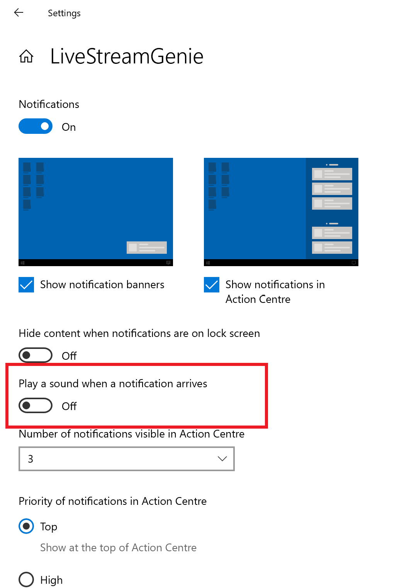

#
 
Make sure you turn off nofication sounds or it will beep every time you get a notification

# Technical Design

This C# code creates an instance of the ApplicationContext class and starts a message loop by calling the Application.Run method, which runs the message loop on the ApplicationContext instance.

An ApplicationContext is a class that manages the lifetime of a Windows Forms application. It provides a context in which forms can be shown and closed, and allows you to define application-level behavior, such as handling unhandled exceptions and controlling the shutdown of the application.

The Application.Run method starts a message loop that processes messages from the operating system and dispatches them to the appropriate forms and controls in the application. This message loop is responsible for handling user input, redrawing the user interface, and executing timers and other asynchronous operations.

Overall, this code is a standard way to start a Windows Forms application and run its message loop, which enables the application to handle user input and interact with the operating system.

Regenerate response