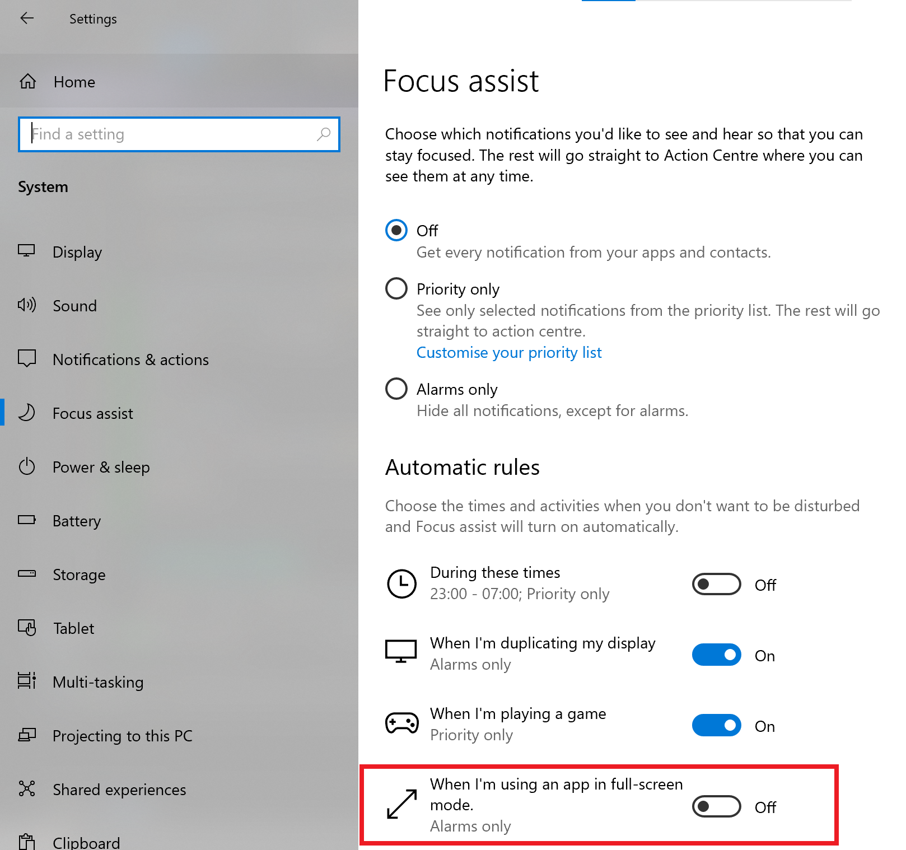

Live Streaming Genie is designed to work with a 2 Stream Setup.

1. From This PC, present your PowerPoint and run Live Stream Genie
2. From your Streaming PC, Setup OBS and turn on OBS Web Socket Server port 4455 and set the password

When you start Live Streaming Genie:
	1. Right Click Live Streaming Genie icon -> Settings to update the password
	2. Right Click Live Streaming Genie icon -> Reconnet to reconnect to OBS

Live Streaming Genie uses the new OBS Web Socket Server 5.x that is shipped with OBS OBS 29.x

Live Streaming Genie is based off Scot Hanselman's [PowerPointToOBSSceneSwitcher](https://github.com/shanselman/PowerPointToOBSSceneSwitcher) which I have been using for years, but just needs that little big of magic to remove friction.

This App has so much potential.

Supported Commands:

* OBS: - switch to named scene
* **Start - Start Recording
* **STOP - Stop Recording
* OBSDEF: - set the OBS default scene if a scene doesn't exist

# Notification
 
Make sure you turn off nofication sounds or it will beep every time you get a notification

To see the notifications when running Powerpoint in presentation mode, you must also allow notifications in full screen node. To do this go to:

Windows + I  (Settings)

System

Focus Assist

"When I'm using an App in Full Screen Mode"

Turn Off

# Technical Design

This C# code creates an instance of the ApplicationContext class and starts a message loop by calling the Application.Run method, which runs the message loop on the ApplicationContext instance.

While this is running, the main Program class is listening out for events from PowerPoint and sending relevant commands to the App Context for processing.

# ICO

I created the favicon from here:

https://www.freeconvert.com/png-to-ico/download

# AutoStartup

to start Live Stream Genie at Windows Startup, first publish the app to the default publish folder, then run the batch script in the csproj folder and it will add to your windows startup.

If you publish to somewhere other than `bin\Release\net6.0-windows\publish\win-x64` you will have to update the batch script.

# Outline Design

At Start:

1. Create StartupSetting object
1. Create OBSContext Object, and pass it the Startup Settings object
1. Create the Notify Icon - setup it's handlers for the context menu, including Reconnect_Click, Setting_Click, About and Quit
1. Start the HeartBeat Time
1. Initialise Power Point Application and set Handlers for Ppt_SlideShowNextSlide, Ppt_SlideShowBegin, Ppt_SlideShowEnd